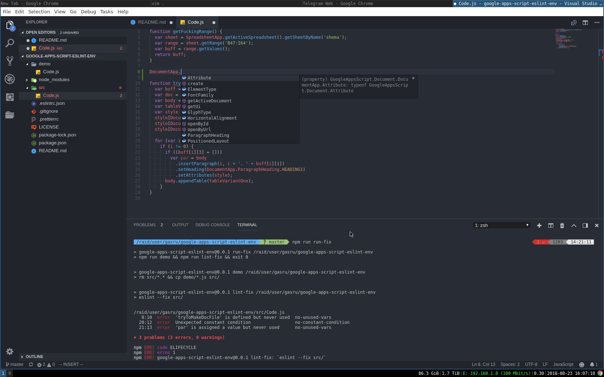

# google-apps-script-eslint-env

# Установка

```sh
$> git clone https://github.com/gasru/google-apps-script-eslint-env.git
$> npm i
$> npm run run-fix

> google-apps-script-eslint-env@0.0.1 run-fix /raid/user/gasru/google-apps-script-eslint-env
> npm run demo && npm run lint-fix && exit 0


> google-apps-script-eslint-env@0.0.1 demo /raid/user/gasru/google-apps-script-eslint-env
> rm src/*.* && cp demo/*.js src/


> google-apps-script-eslint-env@0.0.1 lint-fix /raid/user/gasru/google-apps-script-eslint-env
> eslint --fix src/


/raid/user/gasru/google-apps-script-eslint-env/src/Code.js
   8:10  error  'tryToMakeDocFile' is defined but never used  no-unused-vars
  20:12  error  Unexpected constant condition                 no-constant-condition
  21:13  error  'par' is assigned a value but never used      no-unused-vars

✖ 3 problems (3 errors, 0 warnings)
```

# Проверка правок

После внесения изменений в файл `src/Code.js` можно запустить перепроверку
```sh
$> npm run re-run-fix
```

# Автоавершение кода

Следующие условия необходимы:
* Node.js
* TSServer engine. Входит в состав TypeScript SDK `npm install -g typescript`

## MS Code

[](./static/mscode_autocomplete_view.png)

## Vim совместно с плагином YouCompleteMe

[](./static/vim_ycm_autocomplete_view.png)